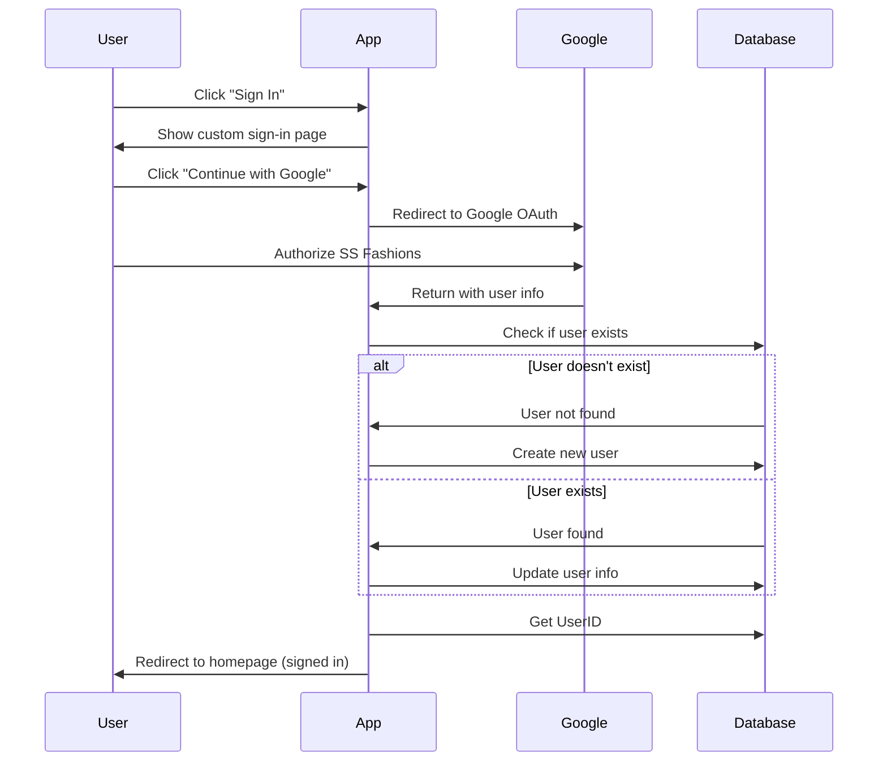

# ✅ Google OAuth Setup Complete

## What Was Configured

I've successfully set up Google OAuth authentication for your SS Fashions e-commerce website using the credentials you provided.

### 1. **Environment Variables Updated** ✓

Your `.env.local` file now contains:
- `GOOGLE_CLIENT_ID`: `25531546104-0rd457qta47ev769vo6sflj73qiraqum.apps.googleusercontent.com`
- `GOOGLE_CLIENT_SECRET`: `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`
- `AUTH_SECRET`: Auto-generated secure secret for session encryption

### 2. **Authentication Configuration Enhanced** ✓

Updated `src/auth.ts` with:
- ✅ Explicit Google OAuth provider configuration
- ✅ Database integration for user management
- ✅ Automatic user creation on first sign-in
- ✅ User profile updates on subsequent sign-ins
- ✅ Session callbacks to attach UserID to sessions
- ✅ Custom sign-in page route

### 3. **Database Tables** ✓

The following tables are created/verified in your Azure SQL Database:
- **Users**: Stores user information (UserID, Email, Name, Image, CreatedAt)
- **Wishlists**: Links users to their saved sarees

### 4. **Custom Sign-In Page** ✓

Created a beautiful, branded sign-in page at `/auth/signin` with:
- 🎨 Premium gradient design matching SS Fashions branding
- 📱 Fully responsive layout
- ✨ Google sign-in button with icon
- 📋 User benefits display
- 🔒 Privacy notice

### 5. **Redirect URIs Configured in Google Console**

Your Google Cloud Console is configured with these redirect URIs:
- `http://localhost:3000/api/auth/callback/google`
- `http://127.0.0.1:3000/api/auth/callback/google`

---

## How to Test

### Step 1: Restart Your Development Server

Your dev server is currently running. You need to restart it to load the new environment variables:

1. Stop the current server (Ctrl+C in the terminal)
2. Run: `npm run dev`

### Step 2: Test Google Sign-In

1. Open your browser and go to: `http://localhost:3000`
2. Click the **"Sign In"** button in the header
3. You'll be redirected to the custom sign-in page
4. Click **"Continue with Google"**
5. Sign in with your Google account
6. You'll be redirected back to the homepage
7. Your name should appear in the header

### Step 3: Test Wishlist Functionality

1. Browse sarees on the homepage
2. Click the heart icon on any saree
3. The saree should be added to your wishlist
4. Visit `/wishlist` to see your saved items

---

## Authentication Flow



---

## Files Modified/Created

### Modified Files
1. **`src/auth.ts`** - Enhanced with database callbacks and Google credentials
2. **`.env.local`** - Added Google OAuth credentials and AUTH_SECRET

### Created Files
1. **`src/app/auth/signin/page.tsx`** - Custom branded sign-in page
2. **`scripts/update-google-credentials.js`** - Helper script for credential setup

---

## Security Notes

🔒 **Important Security Information:**

1. **Never commit `.env.local`** - It's already in `.gitignore`
2. **Client Secret is sensitive** - Keep it private
3. **AUTH_SECRET** - Used for encrypting session tokens
4. **HTTPS in Production** - Always use HTTPS for OAuth in production

---

## Troubleshooting

### Issue: "Sign in failed"
**Solution**: Check that database tables exist by running:
```bash
node scripts/create-auth-tables.js
```

### Issue: "Redirect URI mismatch"
**Solution**: Ensure your Google Cloud Console has these exact URIs:
- `http://localhost:3000/api/auth/callback/google`
- `http://127.0.0.1:3000/api/auth/callback/google`

### Issue: "Database connection error"
**Solution**: Verify your database credentials in `.env.local`:
- `DB_USER`
- `DB_PASSWORD`
- `DB_SERVER`
- `DB_NAME`

---

## Next Steps

### For Production Deployment

When you're ready to deploy to production:

1. **Update Google Cloud Console**:
   - Add production redirect URI: `https://yourdomain.com/api/auth/callback/google`
   - Add production JavaScript origin: `https://yourdomain.com`

2. **Update Environment Variables**:
   - Set all environment variables in your hosting platform
   - Generate a new `AUTH_SECRET` for production

3. **Database**:
   - Ensure production database has Users and Wishlists tables
   - Update firewall rules to allow your hosting platform's IP

### Optional Enhancements

- **Email Verification**: Add email verification for extra security
- **Profile Page**: Create a user profile page to view/edit information
- **Order History**: Link orders to user accounts
- **Social Sharing**: Allow users to share their wishlists

---

## Support

If you encounter any issues:
1. Check the browser console for errors
2. Check the terminal for server-side errors
3. Verify database connection with: `node scripts/test-db.js`
4. Review the `GOOGLE_AUTH_SETUP.md` guide

---

**Status**: ✅ Ready to test! Restart your dev server and try signing in.
